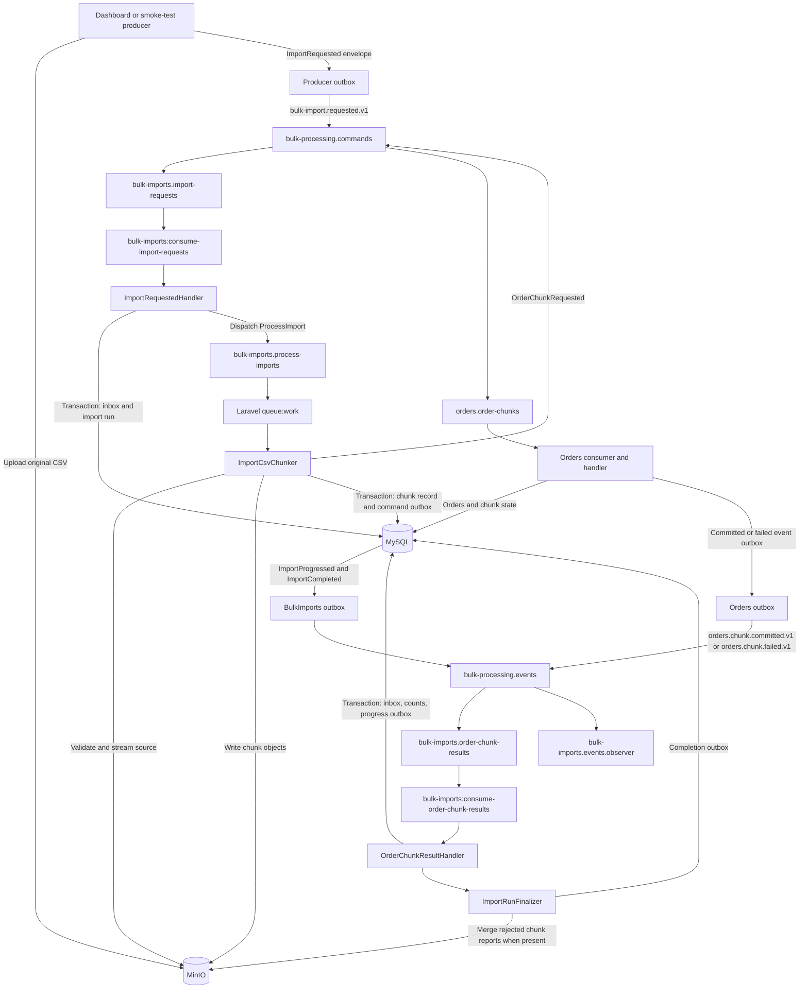

# BulkImports Module

This document explains the current BulkImports implementation: what it owns, how an import moves through the system, where the code lives, and how to run the flow.

See [FUTURE_WORK.md](FUTURE_WORK.md) for deferred design and hardening work. Use [SMOKE_TEST.md](SMOKE_TEST.md) to manually verify the happy path, invalid source files, and an Orders chunk failure reaching BulkImports.

For the chunk-level processing performed by Orders, see [the Orders module handover](../Orders/README.md).

## Responsibility and boundary

BulkImports owns the **original source CSV and import-wide workflow**. It receives an `ImportRequested` message, creates an import run, validates the source CSV, splits it into bounded CSV chunk objects in MinIO, and publishes one `OrderChunkRequested` command for each chunk. It then consumes the Orders chunk results, updates import-wide counts, builds a consolidated rejected-rows report when needed, and publishes progress and completion events.

BulkImports does not upload the file through a user interface yet; the Dashboard module is not implemented. The current smoke test stands in for Dashboard by placing an `ImportRequested` envelope in an outbox row. BulkImports also does not write accepted orders; that belongs to Orders.

The application currently uses shared module queues and long-running workers. Per-import worker startup/shutdown and message isolation are a deferred architecture change; see [FUTURE_WORK.md](FUTURE_WORK.md).

## Message and RabbitMQ topology

The incoming request is `bulk-import.requested.v1`. BulkImports sends `orders.chunk.requested.v1` commands and consumes both `orders.chunk.committed.v1` and `orders.chunk.failed.v1` events. All messages use the shared `MessageEnvelope`; `correlation_id` is the import ID, while each message has its own `message_id` for inbox/outbox idempotency.

Topology is declared from `config/rabbitmq-topology.php` by `sail artisan rabbitmq:topology:declare`.

| Resource | Purpose |
| --- | --- |
| `bulk-processing.commands` (direct exchange) | Routes import requests and chunk requests to their queues. |
| `bulk-imports.import-requests` (quorum queue) | Receives `bulk-import.requested.v1`; delivery-limit failures are dead-lettered. |
| `bulk-imports.process-imports` (quorum queue) | Laravel queue for `ProcessImport` jobs; consumed by `queue:work rabbitmq --queue=bulk-imports.process-imports`. |
| `orders.order-chunks` (quorum queue) | Receives the chunk commands produced by BulkImports; owned and consumed by Orders. |
| `bulk-processing.events` (topic exchange) | Carries Orders outcomes and BulkImports progress/completion events. |
| `bulk-imports.order-chunk-results` (quorum queue) | Receives both `orders.chunk.committed.v1` and `orders.chunk.failed.v1`. |
| `bulk-imports.events.observer` (quorum queue) | Development observer bound to BulkImports progress and completion event types. It is not a business consumer. |
| `bulk-imports.import-requests.failed` and `bulk-imports.order-chunk-results.failed` | Dead-letter queues for repeated failures consuming their respective primary queues. |
| `*.failed.processing-errors` queues | Parking queues for repeated failures while handling a dead-lettered message. There is currently no BulkImports consumer for these queues. |

The producer stores the exchange and routing key in its outbox row. The message type is used as the routing key for these contracts. A queue consumer receives messages from its queue; it does not select messages by routing key.

## End-to-end flow



### 1. Receive and record the request

1. A producer uploads the source CSV to the configured filesystem disk (MinIO in this project) and sends `ImportRequested` with the `import_id` and source object key. The current contract also requires a source checksum string, but BulkImports does not recalculate or verify it.
2. `bulk-imports:consume-import-requests` consumes from `bulk-imports.import-requests`, decodes the envelope, and calls `ImportRequestedHandler`.
3. The handler transactionally records the envelope in `bulk_imports_inbox_messages` and creates the `import_runs` row in `queued` state. The unique inbox `message_id` and import ID make repeated request delivery safe.
4. The handler dispatches a `ProcessImport` Laravel job to `bulk-imports.process-imports`, then marks the request inbox record processed. The RabbitMQ request is acknowledged after the handler succeeds.

### 2. Validate and split the source CSV

1. A Laravel worker consumes `ProcessImport` from `bulk-imports.process-imports`; it calls `ImportCsvChunker` with the import run's database ID.
2. The chunker marks the run `processing` and reads the source CSV as a stream. It checks the configured exact header list and that each data row has the expected number of columns. The configured chunk size is 1,000 rows.
3. It counts rows before publishing chunk requests, stores `total_rows` and `total_chunks`, then reads the source again and writes chunk objects under `imports/{import_id}/chunks/chunk-{number}.csv`.
4. For each chunk, it stores an `import_chunks` row and a deterministic `OrderChunkRequested` outbox row. The chunk object write happens before the MySQL transaction; the database transaction keeps the chunk record and command outbox intent together.
5. `BulkImportsOutboxPublisher` later publishes pending commands to `bulk-processing.commands`, using `orders.chunk.requested.v1` as routing key. Orders owns the subsequent row validation and MySQL order inserts.

Invalid source headers, malformed source rows, and a source with no data rows are terminal input failures. `ImportRunFinalizer::failSource()` marks the run failed and records `ImportCompleted` in the same database transaction. Since a malformed source may not have a reliable total, `total_rows` can be `null` for a failed completion event. Storage or other runtime errors are not converted into invalid-CSV failures; they escape the job and follow Laravel queue retry behavior.

### 3. Consume chunk outcomes and update progress

1. Orders writes either `OrdersChunkCommitted` or `OrdersChunkFailed` to its outbox. `orders:outbox:publish` sends the event to `bulk-processing.events`.
2. `bulk-imports:consume-order-chunk-results` consumes either outcome from `bulk-imports.order-chunk-results` and calls `OrderChunkResultHandler`.
3. In one MySQL transaction, the handler writes the inbox record, locks the import and chunk, applies the result once, increments import counters, and creates a deterministic `ImportProgressed` outbox row. Repeated delivery is deduplicated by message ID and terminal chunk status.
4. A committed chunk records accepted and rejected counts and result object keys. A failed chunk records the terminal failure and attempts. Failed chunks do not add their rows to `processed_rows`, `accepted_rows`, or `rejected_rows`; they still increment `processed_chunks`.
5. After each result, `ImportRunFinalizer` checks whether every expected chunk has a result. It marks the import `failed` if any chunk failed, `completed_with_errors` if rows were rejected, or `completed` otherwise.

Row-level order validation failures are not source-CSV failures and do not send the whole chunk to the DLQ. Orders commits accepted rows, returns rejected rows and their report object key, and BulkImports includes them in the import-level rejected report.

### 4. Finalize the import

When all chunks have results, `RejectedRowsReportBuilder` merges the chunk-level rejected CSV objects, in source-row order, into `imports/{import_id}/reports/rejected.csv`. The builder streams each source report and uses a bounded temporary stream rather than loading the whole import report into a PHP string.

The finalizer writes one deterministic `ImportCompleted` event to the BulkImports outbox. A later outbox publish sends it to `bulk-processing.events`; the development observer queue is bound to `bulk-import.progressed.v1` and `bulk-import.completed.v1`. The future Dashboard module should have its own queue and inbox for these events.

## Database tables

| Table | Purpose |
| --- | --- |
| `import_runs` | One import-wide record with source key, lifecycle status, row/chunk counters, failure details, and timestamps. |
| `import_chunks` | One record per `(import_run_id, chunk_id)` with source row range, object keys, outcome counts, status, and failure details. |
| `bulk_imports_inbox_messages` | Incoming-message deduplication and processing status for import requests and Orders results. |
| `bulk_imports_outbox_messages` | Pending/published commands and events, including exchange, routing key, attempts, and last error. |

Inbox, import/chunk state, and outgoing event intent are written transactionally by their handlers where applicable. RabbitMQ publishing happens later from the outbox. Delivery is at least once; consumers must remain idempotent.

## Code map

| File | Role |
| --- | --- |
| `app/Messaging/Contracts/V1/ImportRequested.php` | Shared import request contract. |
| `app/Messaging/Contracts/V1/OrderChunkRequested.php` | Shared chunk command contract sent to Orders. |
| `app/Messaging/Contracts/V1/OrdersChunkCommitted.php` / `OrdersChunkFailed.php` | Shared results consumed from Orders. |
| `app/Messaging/Contracts/V1/ImportProgressed.php` / `ImportCompleted.php` | Shared progress and terminal events emitted by BulkImports. |
| `app/Console/Commands/ConsumeImportRequests.php` | Consumes and acknowledges import requests after handler success. |
| `Modules/BulkImports/app/Handlers/ImportRequestedHandler.php` | Stores inbox/import run and dispatches the processing job. |
| `Modules/BulkImports/app/Jobs/ProcessImport.php` | Laravel queued job for one import run. |
| `Modules/BulkImports/app/Services/ImportCsvChunker.php` | Validates source CSV, calculates totals, writes chunk objects and command outbox rows. |
| `Modules/BulkImports/app/Handlers/OrderChunkResultHandler.php` | Applies committed/failed chunk results, counters, inbox idempotency, and progress outbox. |
| `Modules/BulkImports/app/Services/ImportRunFinalizer.php` | Chooses terminal import status and creates completion outbox events. |
| `Modules/BulkImports/app/Services/RejectedRowsReportBuilder.php` | Merges rejected chunk reports into the import-level report. |
| `Modules/BulkImports/app/Services/BulkImportsOutboxPublisher.php` | Publishes due outbox rows with persistent messages, confirms, mandatory routing, and retry scheduling. |
| `app/Console/Commands/ConsumeOrderChunkResults.php` | Consumer for Orders committed and failed events. |
| `app/Console/Commands/PublishBulkImportsOutbox.php` | One-shot BulkImports outbox publisher command. |
| `config/rabbitmq-topology.php` | Exchanges, queues, dead-letter routes, and event observer bindings. |
| `routes/console.php` | Schedules both module outbox publishers once per minute. |

## Useful commands

```bash
sail artisan rabbitmq:topology:declare
sail artisan bulk-imports:consume-import-requests
sail artisan queue:work rabbitmq --queue=bulk-imports.process-imports --tries=3
sail artisan orders:consume-chunks
sail artisan orders:consume-failed-chunks
sail artisan bulk-imports:consume-order-chunk-results
sail artisan bulk-imports:outbox:publish
sail artisan orders:outbox:publish
sail artisan schedule:work
```

The consumer commands and `queue:work` are long-running processes; run each in its own terminal. `schedule:work` runs the scheduled outbox commands every minute. During a controlled smoke test, manually run the publisher commands between stages instead of running both methods at once.

## Current limitations

- Dashboard upload/request creation and Dashboard progress/completion consumption are not implemented.
- Per-import worker pools and their queue isolation/lifecycle are not implemented. Current workers are shared and continuously running.
- Automated BulkImports regression tests are deferred; see [FUTURE_WORK.md](FUTURE_WORK.md).
- Source checksum is required by the request contract but not verified by BulkImports. Chunk checksums are not part of the current chunk contract.
- A terminal Laravel queue failure from an infrastructure error can leave an import in `processing`; a failed-job recovery path is future work.
- The scheduled publisher has up to one minute of latency when the scheduler is active. Manual publishing was used in the smoke test for deterministic stage-by-stage checks.
