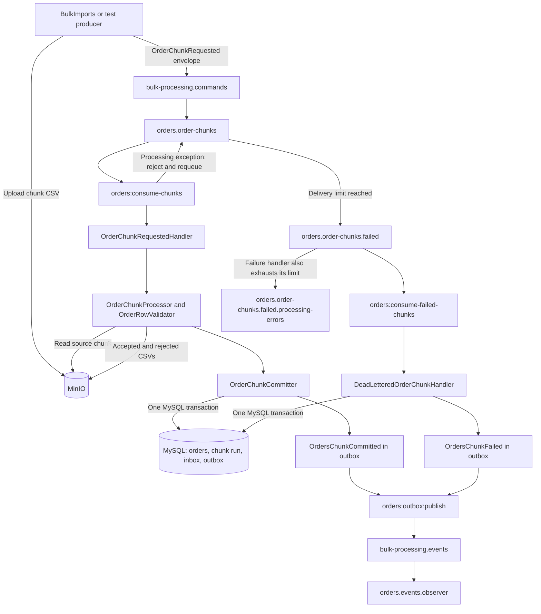

# Orders Module

This document explains the current Orders module implementation: what it owns, how a chunk moves through it, where each part of the code lives, and how to review or run the flow.

## Responsibility and boundary

The Orders module receives **already-split CSV chunks**. It reads each chunk from the configured filesystem disk (MinIO in this project), validates its rows, inserts accepted orders into MySQL, stores accepted and rejected result files in MinIO, and publishes a chunk outcome through its outbox.

The module does not receive the administrator's original large CSV, split it into chunks, or own import-wide progress. Those responsibilities belong to the future BulkImports module. Analytics will consume committed chunk events later.

## Message and RabbitMQ topology

The input contract is `orders.chunk.requested.v1`, represented by `OrderChunkRequested` inside the shared `MessageEnvelope`. The envelope supplies message ID and correlation ID; the contract supplies the import ID, chunk ID, MinIO object key, first source row number, and expected data-row count.

The topology is declared from `config/rabbitmq-topology.php` by `rabbitmq:topology:declare`:


| Resource                                                      | Purpose                                                                                                                                                                              |
| ------------------------------------------------------------- | ------------------------------------------------------------------------------------------------------------------------------------------------------------------------------------ |
| `bulk-processing.commands` (direct exchange)                  | Routes chunk commands to the Orders queue.                                                                                                                                           |
| `orders.order-chunks` (quorum queue)                          | Receives `orders.chunk.requested.v1`; has delivery limit 3 and dead-letters exhausted messages.                                                                                      |
| `bulk-processing.dead-letters` (direct exchange)              | Routes exhausted chunk requests to the failed queue.                                                                                                                                 |
| `orders.order-chunks.failed` (quorum queue)                   | Holds requests that exhausted retries on the main queue. If its own consumer repeatedly fails, it dead-letters to the processing-errors queue.                                       |
| `orders.order-chunks.failed.processing-errors` (quorum queue) | Parking queue for failures while handling a dead-lettered request. There is currently no consumer for it.                                                                            |
| `bulk-processing.events` (topic exchange)                     | Receives the Orders outcome events from the outbox.                                                                                                                                  |
| `orders.events.observer` (quorum queue)                       | Development observer bound to `orders.chunk.#` so published events can be inspected in RabbitMQ UI. It is not a business consumer; messages remain queued until consumed or removed. |


The routing key for an event is its contract message type: `orders.chunk.committed.v1` or `orders.chunk.failed.v1`. The outbox row stores both the exchange and routing key. `OrdersOutboxPublisher` publishes those stored values.

## End-to-end flow




### Successful chunk, including row-level rejects

1. A producer uploads a chunk CSV to MinIO and publishes `OrderChunkRequested` to `bulk-processing.commands` with routing key `orders.chunk.requested.v1`.
2. `orders:consume-chunks` consumes one message at a time (`basic_qos` prefetch 1). It decodes the envelope and calls `OrderChunkRequestedHandler`.
3. The handler rejects unsupported contract types, then asks `OrderChunkProcessor` to validate the CSV and write result files.
4. The processor reads the configured filesystem disk as a stream. It checks the exact header names, CSV column count, and that the number of data rows matches `row_count`. It assigns source row numbers starting at `row_start`.
5. `OrderRowValidator` checks required fields, string lengths, positive numeric amount, three-letter alphabetic currency, and date. It uppercases valid currency values. The processor also rejects duplicate `order_id` values within the chunk and IDs already in `orders`.
6. Valid rows go to `imports/{importId}/accepted/{chunkId}.csv`; invalid rows and their validation errors go to `imports/{importId}/rejected/{chunkId}.csv`. A file is only created for a non-empty result set. These objects are private.
7. `OrderChunkCommitter` opens one MySQL transaction. It deduplicates the incoming message by inbox `message_id`, guards the logical chunk by `(import_id, chunk_id)`, inserts accepted orders, marks the chunk run committed, creates an `OrdersChunkCommitted` outbox record, and marks the inbox record processed.
8. Only after the handler succeeds does the RabbitMQ consumer acknowledge the command. A duplicate processed inbox message is a no-op; a chunk already committed is not inserted again.
9. The outbox publisher sends the event to `bulk-processing.events`. The development observer binding lets the event be inspected in RabbitMQ UI. Future modules should have their own queues bound to the event types they consume.

Row-level validation errors do **not** send the whole chunk to the DLQ. The chunk commits accepted rows and records rejected rows in the rejected CSV and chunk counters.

### Chunk-level failure and DLQ

An unreadable source object, invalid header, malformed CSV structure, row-count mismatch, database failure, or another thrown processing exception causes the main consumer to `basic_reject` with requeue enabled. The quorum queue tracks failed deliveries; after its configured limit, RabbitMQ routes the original `OrderChunkRequested` message to `orders.order-chunks.failed`.

`orders:consume-failed-chunks` calls `DeadLetteredOrderChunkHandler`. The handler uses the inbox for idempotency, marks the logical chunk run failed, stores the delivery count and the current generic reason (`delivery_limit_exceeded`), creates an `OrdersChunkFailed` outbox record, and marks the inbox processed. The failed-queue message is acknowledged after that transaction succeeds.

The handler does not retry the CSV import. It records that the chunk exhausted its broker retries and emits a business failure event. If this handler itself fails repeatedly, RabbitMQ routes the message to `orders.order-chunks.failed.processing-errors`, which currently requires manual inspection or replay.

## Database tables


| Table                    | Purpose                                                                                                                               |
| ------------------------ | ------------------------------------------------------------------------------------------------------------------------------------- |
| `orders`                 | Accepted domain order rows. `order_id` is unique.                                                                                     |
| `order_chunk_runs`       | One status/progress record per `(import_id, chunk_id)`, including row counts, result object keys, attempts, and failure details.      |
| `orders_inbox_messages`  | Incoming-message deduplication and processing status. `message_id` is unique; the stored payload is the envelope for audit/debugging. |
| `orders_outbox_messages` | Events committed with Orders state, including exchange/routing metadata, publication status, retries, and last error.                 |


The main and failed-message handlers write their inbox/chunk/outbox state in a database transaction. This makes the MySQL state and event intent atomic. The actual RabbitMQ publish occurs later through the outbox publisher.

## Code map


| File                                                            | Role                                                                                                                                   |
| --------------------------------------------------------------- | -------------------------------------------------------------------------------------------------------------------------------------- |
| `app/Messaging/Contracts/V1/OrderChunkRequested.php`            | Shared input contract.                                                                                                                 |
| `app/Messaging/Contracts/V1/OrdersChunkCommitted.php`           | Event for a chunk that finished, including accepted/rejected counts and result object keys.                                            |
| `app/Messaging/Contracts/V1/OrdersChunkFailed.php`              | Event for a chunk that exhausted retries.                                                                                              |
| `app/Console/Commands/ConsumeOrderChunks.php`                   | Main RabbitMQ consumer; decodes, dispatches, rejects/requeues failures, and acknowledges successes.                                    |
| `Modules/Orders/app/Handlers/OrderChunkRequestedHandler.php`    | Coordinates contract check, processing, result-file writing, and commit.                                                               |
| `Modules/Orders/app/Services/OrderChunkProcessor.php`           | Reads the CSV, classifies rows, and writes accepted/rejected CSVs to the configured filesystem.                                        |
| `Modules/Orders/app/Services/OrderRowValidator.php`             | Applies row-level field validation and currency normalization.                                                                         |
| `Modules/Orders/app/Services/OrderChunkCommitter.php`           | Transactionally writes orders, chunk status, inbox, and committed-event outbox row.                                                    |
| `app/Console/Commands/ConsumeFailedOrderChunks.php`             | Consumer for `orders.order-chunks.failed`; extracts delivery attempts and acknowledges handled failures.                               |
| `Modules/Orders/app/Handlers/DeadLetteredOrderChunkHandler.php` | Transactionally records terminal chunk failure and creates the failure-event outbox row.                                               |
| `Modules/Orders/app/Services/OrdersOutboxPublisher.php`         | Publishes due outbox rows as persistent RabbitMQ messages with confirms and mandatory routing; schedules a retry after publish errors. |
| `app/Console/Commands/PublishOrdersOutbox.php`                  | One-shot command that runs the outbox publisher.                                                                                       |
| `app/Console/Commands/DeclareRabbitMqTopology.php`              | Declares exchanges, queues, and bindings from configuration.                                                                           |
| `config/rabbitmq-topology.php`                                  | RabbitMQ topology, queue arguments, dead-letter routes, and observer binding.                                                          |
| `routes/console.php`                                            | Schedules outbox publishing every minute with overlap prevention.                                                                      |
| `Modules/Orders/app/Models/`                                    | Eloquent models for the four Orders-owned tables.                                                                                      |
| `Modules/Orders/database/migrations/`                           | Table definitions for those models.                                                                                                    |


## Useful commands

```bash
sail artisan migrate
sail artisan rabbitmq:topology:declare
sail artisan orders:consume-chunks
sail artisan orders:consume-failed-chunks
sail artisan orders:outbox:publish
sail artisan schedule:work
```

The two consumer commands are long-running processes; run them in separate terminals. `orders:outbox:publish` is useful for deterministic manual checks. In normal development, `schedule:work` runs the scheduled publisher every minute.

## What the smoke checks confirmed

- A chunk with two valid rows and one invalid amount imported two orders, normalized lowercase currency to uppercase, and wrote one rejected row to MinIO.
- The inbox was marked processed, the chunk run was committed, and the committed event reached the observer queue after its topology binding was added.
- A chunk with an invalid header failed processing, was retried, reached the DLQ, and was recorded as failed. The failed command created an `OrdersChunkFailed` outbox event; after fixing the observer binding, that event was published.
- The failed chunk did not insert an order. The observed delivery count was 4 with queue limit 3 because RabbitMQ dead-letters after the count exceeds the configured limit.


## Current limitations to remember while reviewing

- The original processing exception is reported to Laravel logs by the consumer. The DLQ handler currently records the generic `delivery_limit_exceeded` code/message, not the original exception text.
- CSV rows are read as a stream, but accepted/rejected row data is accumulated in memory for one chunk before database insertion and output generation. Keep chunks bounded; this implementation does not load the million-row source file as one chunk.
- The observer queue is for development inspection. It is not the future Analytics or BulkImports consumer queue. Each real subscriber should get its own queue and binding so RabbitMQ delivers an event copy to every interested module.
- The Orders module consumes chunk requests only. Uploading the source file, splitting it, tracking import-wide progress, and analytics loading remain outside this module.
