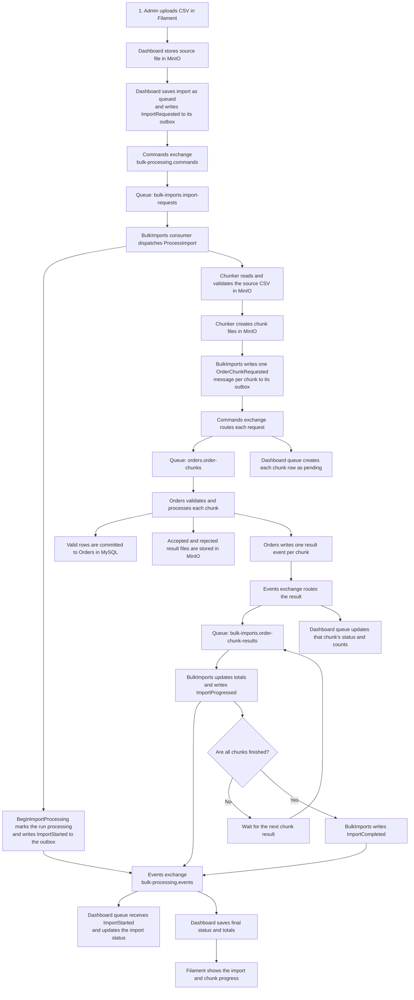

# Bulk Order Import Demo

## Purpose

This Laravel modular-monolith demo shows how a large orders CSV moves from an admin upload through RabbitMQ consumers and bounded chunk processing until the accepted orders are stored in MySQL and the dashboard shows the final result.

The current implemented path uses MinIO for files, RabbitMQ for small versioned messages, and MySQL for order and import data. ClickHouse analytics, Vitess, an orchestration module, and per-import worker pools are not part of the current flow.

## Modules

| Module | Responsibility | Owns |
|---|---|---|
| **Dashboard** | Filament upload and import view; starts an import and maintains a UI-facing status projection. | Dashboard import/chunk projection, inbox, and outbox. |
| **BulkImports** | Tracks an import, validates and chunks the source CSV, dispatches chunk requests, aggregates chunk outcomes, and finalizes the import. | Import runs/chunks, inbox, and outbox. |
| **Orders** | Reads and validates each chunk, writes accepted orders, records rejected rows, and reports the outcome. | Orders, chunk runs, inbox, and outbox. |
| **MessageContracts** | Defines versioned message types and the shared message envelope used by producers and consumers. | Message schemas only; no business state. |

Each module owns its tables. Modules coordinate through RabbitMQ contracts rather than querying another module's business tables or calling its business services.

## Current end-to-end flow

The CSV and chunk contents are stored in MinIO. RabbitMQ carries small messages containing identifiers, counts, statuses, and object keys; it does not carry the CSV rows. Dashboard and BulkImports keep their own projections/state, while Orders owns order persistence in MySQL.



### Walkthrough

1. An administrator uploads a CSV in Filament. Dashboard stores the source file in MinIO, creates its import record with `queued` status, and writes `ImportRequested` to its outbox.
2. The outbox publisher sends the envelope to RabbitMQ. The `bulk-imports.import-requests` consumer records the message in its inbox and dispatches Laravel's `ProcessImport` job to `bulk-imports.process-imports`.
3. `ProcessImport` begins the import: BulkImports changes its run to `processing` and writes `ImportStarted` to its outbox. The CSV chunker validates the expected headers and reads the source incrementally, producing bounded chunk objects in MinIO and one `OrderChunkRequested` outbox message per chunk.
4. RabbitMQ routes each chunk request to `orders.order-chunks`. The same request is also routed to Dashboard so it can create a pending chunk row for display.
5. Orders reads each chunk object, validates rows, writes accepted orders to MySQL, and stores accepted/rejected result artifacts in MinIO. A chunk can have both accepted and rejected rows; that is a successful chunk with row-level errors. Orders writes `OrdersChunkCommitted` with the counts and object keys. Repeated delivery-limit failures instead produce `OrdersChunkFailed` through the Orders failure handling path.
6. RabbitMQ routes the chunk result to both `bulk-imports.order-chunk-results` and Dashboard. BulkImports updates its chunk and import counts, then writes `ImportProgressed`. Dashboard independently updates its chunk projection.
7. Once every chunk has a terminal outcome, BulkImports writes a single `ImportCompleted` event. Dashboard consumes it and stores the final status, counts, and rejected-report object key for Filament.

### RabbitMQ routing at a glance

| Message | Exchange and routing key | Destination queue(s) | Why it is sent |
|---|---|---|---|
| `bulk-import.requested.v1` | `bulk-processing.commands` / `bulk-import.requested.v1` | `bulk-imports.import-requests` | Ask BulkImports to start preparing an import. |
| `bulk-import.started.v1` | `bulk-processing.events` / `bulk-import.started.v1` | `dashboard.import-status-updates` | Tell Dashboard that processing has begun. |
| `orders.chunk.requested.v1` | `bulk-processing.commands` / `orders.chunk.requested.v1` | `orders.order-chunks`, `dashboard.import-status-updates` | Ask Orders to process a chunk and let Dashboard create its pending row. |
| `orders.chunk.committed.v1` | `bulk-processing.events` / `orders.chunk.committed.v1` | `bulk-imports.order-chunk-results`, `dashboard.import-status-updates` | Report a durably processed chunk, including accepted/rejected counts. |
| `orders.chunk.failed.v1` | `bulk-processing.events` / `orders.chunk.failed.v1` | `bulk-imports.order-chunk-results`, `dashboard.import-status-updates` | Report a chunk that exhausted delivery attempts. |
| `bulk-import.progressed.v1` | `bulk-processing.events` / `bulk-import.progressed.v1` | `dashboard.import-status-updates` and the observer queue | Publish updated aggregate counts after a chunk result. |
| `bulk-import.completed.v1` | `bulk-processing.events` / `bulk-import.completed.v1` | `dashboard.import-status-updates` and the observer queue | Publish the terminal import status and final counts. |

Commands use the direct `bulk-processing.commands` exchange. Events use the topic `bulk-processing.events` exchange. A routing key determines which queues receive a published message through their bindings. A consumer reads from its queue; it does not select messages from an exchange by routing key.

Messages use a versioned `MessageEnvelope` containing `message_id`, `message_type`, `correlation_id`, `occurred_at`, and `data`. For this flow, `correlation_id` is the import ID, which lets logs and related messages be connected across modules. Each module has its own prefixed inbox and outbox tables to support idempotent consumption and reliable publication.

The queues ending in `.failed` are dead-letter queues for deliveries that exceeded the primary queue's retry/delivery limit. Their `.failed.processing-errors` queues are a second parking place if handling the first dead-letter queue itself repeatedly fails. They are separate from the business event `orders.chunk.failed.v1`.

### Import and chunk statuses

- Dashboard creates an import as `queued` after saving the upload and its start command.
- BulkImports marks its run `processing` when its queued `ProcessImport` job begins and emits `ImportStarted`; Dashboard reflects that after its status consumer handles the event.
- Each Dashboard chunk row starts as `pending`. It changes when the matching committed or failed chunk result is consumed.
- A chunk may finish as `completed` or `completed_with_errors` when it was processed but contained rejected rows; a delivery failure after retries is `failed`.
- The import finishes as `completed`, `completed_with_errors`, or `failed`, based on all chunk outcomes and source-file validation.
- Progress is event-driven: BulkImports publishes aggregate progress after chunk outcomes. The current Filament page requires a manual refresh to fetch the latest projection; automatic polling is not implemented.

## RabbitMQ and worker setup

The topology is defined in `config/rabbitmq-topology.php` and can be recreated with:

```bash
sail artisan rabbitmq:topology:declare
```

The topology uses three durable exchanges: direct `bulk-processing.commands`, topic `bulk-processing.events`, and direct `bulk-processing.dead-letters`. Business consumer queues are durable quorum queues with dead-letter routing configured. `bulk-imports.process-imports` is the Laravel queue used for `ProcessImport` jobs; it is not a business-message consumer queue.

Each outbox publisher is scheduled every five seconds with overlap prevention. The RabbitMQ consumer commands and Laravel queue worker are long-running shared processes. All imports share the configured queues; this implementation does not create an isolated queue or worker pool for every import ID. `ORDERS_DEMO_CHUNK_DELAY_SECONDS` can add a local delay to Orders chunk processing to make progress visible during a demo; its default is zero.

## Current boundaries and future work

- MySQL is the operational store for Orders and module state. Vitess is not configured in the current flow.
- ClickHouse and the Analytics module are not implemented. There is no ClickHouse load step in this demo's current end-to-end path.
- Per-import worker pools, automatic Filament polling, cancellation, and admin retry/resume controls are not implemented.
- The current flow is a modular monolith with shared application deployment and shared queues, not a set of independently deployed microservices.

See [BulkImports/FUTURE_WORK.md](Modules/BulkImports/FUTURE_WORK.md), [BulkImports/README.md](Modules/BulkImports/README.md), and [BulkImports/SMOKE_TEST.md](Modules/BulkImports/SMOKE_TEST.md) for follow-up ideas and module-specific operational detail.
