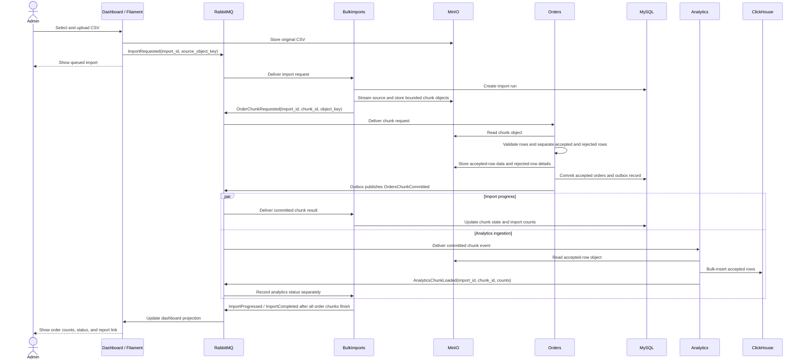

# Bulk Order Import Demo

## Purpose

This document is the reference plan for a learning demo that imports a large order file through a modular Laravel application. An administrator starts an import from Filament. The system stores the source file in MinIO, divides it into chunks, validates and writes accepted orders to MySQL, and sends accepted order data to ClickHouse for analytics.

The first version uses the MySQL service already present in Compose. Vitess is out of scope for this version. The design should keep the Orders module's database connection behind its own boundary so MySQL can later be replaced by Vitess without changing the other modules' message contracts.

## Learning goals

- Distinguish a bulk operation from its queue jobs and chunks.
- Process large files without loading the whole file or whole dataset into memory.
- Use RabbitMQ to communicate between modules with small, versioned messages.
- Store large source, chunk, accepted-row, and error files in MinIO rather than in RabbitMQ messages.
- Write operational orders to MySQL and analytical data to ClickHouse.
- Handle duplicate delivery, retries, partial success, and progress reporting.

## Architecture decisions

1. **Modular monolith:** one Laravel application and deployment, organized into purpose-specific modules with `nwidart/laravel-modules`.
2. **RabbitMQ module boundary:** a module does not call another module's services or query another module's tables. It publishes or consumes a message instead.
3. **Own your data:** Orders owns order tables in MySQL; BulkImports owns import-run state; Analytics owns ClickHouse tables; Dashboard owns its read projection.
4. **Keep messages small:** messages carry IDs, object keys, checksums, counts, and status. File contents remain in MinIO.
5. **At-least-once-safe consumers:** assume a message or chunk can be delivered again. Consumers must be idempotent.
6. **Chunk-level progress:** the import is one user-visible operation, but persistence and recovery happen per chunk. Do not promise one transaction across the entire file.
7. **Separate import success from analytics freshness:** an order can be committed to MySQL while its ClickHouse projection is still processing. Display both states.
8. **No scheduled run in the first version:** an administrator starts each bulk import in Filament. Scheduling can be added later as a separate learning step.

## Modules and purpose

| Module | Single purpose | Owns / stores | Communicates through RabbitMQ |
|---|---|---|---|
| **Dashboard** | Let an administrator start imports and inspect their progress and results. | Filament panel and a dashboard status projection. | Publishes the start command; consumes import status and progress events for its projection. |
| **BulkImports** | Manage the lifecycle of a bulk import and coordinate chunks. | `import_runs`, `import_chunks`, source-file metadata, and retry state in MySQL. | Accepts start commands; requests order-chunk processing; consumes per-chunk results; publishes progress and terminal status. |
| **Orders** | Apply order rules and persist accepted orders. | Order tables and transactional outbox in MySQL. | Consumes chunk requests; publishes committed/rejected counts and a pointer to accepted rows. |
| **Analytics** | Ingest accepted order data into ClickHouse and expose analytical read models. | ClickHouse tables for imported order facts and import metrics. | Consumes committed-chunk messages; publishes analytics ingestion status. |
| **MessageContracts** | Define stable message envelopes and schemas shared by producers and consumers. | Versioned message definitions; no business data store. | Defines message names, versions, correlation IDs, and payload shape. |

`MessageContracts` is an integration-contract library, not a business module. It should not contain order or import behavior.

## End-to-end flow

The CSV is the source file, not the message sent through RabbitMQ. MinIO stores the
original file and bounded chunk files; RabbitMQ carries small messages that identify
those files. The orders are ultimately stored in MySQL. ClickHouse is an asynchronous
analytics destination, not a substitute for the order database.

1. **Upload:** The administrator selects a CSV in Filament. The Dashboard assigns an
   import ID, stores the original CSV in MinIO, and publishes an
   `ImportRequested` message with the import ID and object key. The browser request
   finishes after the import is queued; it does not wait for all rows to be processed.
2. **Prepare:** `BulkImports` consumes the request, creates the import run, and reads
   the CSV incrementally. It checks the file structure and splits its rows into
   bounded chunks without loading the million-row file into memory.
3. **Dispatch:** `BulkImports` stores each chunk as an object in MinIO, creates its
   chunk record, and publishes an `OrderChunkRequested` message with the import ID,
   chunk ID, and object key. RabbitMQ carries the reference rather than the whole CSV
   or an unbounded payload.
4. **Import orders:** `Orders` consumes each chunk request, reads that chunk from
   MinIO, validates the rows, and writes accepted orders to MySQL in a bounded
   transaction. It records rejected rows with their source row numbers and reasons.
   Chunk-level commits let the system recover without making the entire file one
   enormous transaction.
5. **Report outcomes:** After a chunk is durably handled, `Orders` publishes its
   result through an outbox. `BulkImports` consumes the result and updates the import
   counts and progress. Rejected-row details can be stored in MinIO for download.
6. **Update analytics:** A separate Analytics queue also receives the committed
   chunk event. `Analytics` reads the accepted-row data from MinIO and bulk-inserts it
   into ClickHouse. It reports its own per-chunk status.
7. **Show completion:** When all order chunks have reported their outcomes,
   `BulkImports` marks the import `completed` or `completed_with_errors` and publishes
   the final status. The Dashboard consumes status events and shows the counts and
   any rejection-report link. ClickHouse may still be catching up; analytics freshness
   is displayed separately and does not block the order import from completing.



### Example message payloads

Messages should be JSON-compatible, versioned contracts rather than large serialized job payloads. Exact exchange and queue names can be settled during implementation.

```json
{
  "message_id": "uuid",
  "message_type": "bulk-import.requested.v1",
  "correlation_id": "import-uuid",
  "occurred_at": "2026-09-28T10:15:00Z",
  "data": {
    "import_id": "import-uuid",
    "source_object_key": "imports/import-uuid/source.csv",
    "source_checksum": "sha256:...",
    "requested_by": "user-id"
  }
}
```

A chunk message should similarly carry `import_id`, `chunk_id`, `object_key`, `row_start`, `row_count`, and a checksum—not every order row.

## Import-run lifecycle

Suggested import states:

`uploaded -> queued -> processing -> completed | completed_with_errors | failed | cancelled`

Each chunk has its own state:

`pending -> processing -> committed | completed_with_errors | failed`

Analytics has a separate per-chunk state, such as `pending`, `loaded`, or `failed`. An import can therefore be complete in MySQL while its ClickHouse data is still catching up.

The run should record at least the original object key and checksum, who started it, timestamps, total/processed/accepted/rejected row counts, and a downloadable error-report object key. Chunk records should include attempts, status, row counts, and the last failure reason.

## Task backlog

Tasks are ordered by dependency. Each task should be reviewable before moving to the next group.

### Epic 1 — Define contracts and module boundaries

1. **Use the existing Dashboard module and create skeletons** for BulkImports, Orders, and Analytics using the installed modules package.
   - **Acceptance:** each module has its own provider and expected folder structure; no business code lives in the default `app/` namespace except shared application bootstrap code.
2. **Define ownership and data boundaries.**
   - **Acceptance:** Orders is the only module that reads/writes order tables; BulkImports owns import state; Analytics owns ClickHouse tables; Dashboard reads its projection.
3. **Define the message envelope and versioned contracts.**
   - **Acceptance:** every message has a message ID, type/version, correlation ID, timestamp, and a documented data payload; no contract contains an entire CSV or unbounded row list.
4. **Define retry and duplicate rules.**
   - **Acceptance:** each consumer documents its idempotency key, transient retry policy, permanent-error handling, and dead-letter behavior.

### Epic 2 — Prepare storage and run tracking

5. **Create BulkImports run and chunk records in MySQL.**
   - **Acceptance:** the system can persist a run, individual chunk states, counters, timestamps, and error object references.
6. **Configure MinIO object paths and retention expectations.**
   - **Acceptance:** source, chunk, accepted-row, and rejected-row objects use paths scoped by import and chunk IDs; the source checksum is retained.
7. **Define order import identity and duplicate policy.**
   - **Acceptance:** the same source row can be retried without creating a second order; the behavior for an existing external order ID is explicit (skip, update, or reject).

### Epic 3 — Start an import from Filament

8. **Build the Filament bulk-import page.**
   - **Acceptance:** an authorized admin can upload the expected CSV format, review validation errors, and start an import.
9. **Store the source file and publish the start command.**
   - **Acceptance:** the original file is in MinIO; the UI sends a `BulkImportRequested` message with its import ID, object key, and checksum; the UI reports a clear queued/failed-to-queue result.
10. **Build the dashboard status projection.**
    - **Acceptance:** the dashboard consumes import status events and shows state, progress counts, timestamps, and links to available error reports without calling another module's business service.

### Epic 4 — Split and dispatch chunks

11. **Validate the source-file structure.**
    - **Acceptance:** missing/unknown headers, malformed files, and unsupported formats fail before row jobs are created, with a visible reason.
12. **Split the source into bounded chunk objects.**
    - **Acceptance:** chunking uses bounded memory; chunk metadata includes row range, count, and checksum; the original file remains available.
13. **Create chunk records and publish chunk requests.**
    - **Acceptance:** each message references one persisted chunk; publishing can be retried without creating duplicate logical chunks.

### Epic 5 — Validate and persist orders

14. **Consume chunk requests in the Orders module.**
    - **Acceptance:** the consumer reads the referenced MinIO object, validates each row, and separates accepted rows from row-level errors.
15. **Bulk-write accepted orders to MySQL.**
    - **Acceptance:** writes occur in bounded groups and transaction scope is per chunk; duplicate deliveries do not duplicate orders.
16. **Persist result artifacts and a transactional outbox message.**
    - **Acceptance:** accepted-row and rejected-row objects are written to MinIO before the database transaction; rejected rows have source row numbers and actionable reasons; the transaction writes accepted orders and an outbox record referencing the already-written accepted-row object. An outbox relay publishes only committed records, so a crash after the database commit cannot silently lose the RabbitMQ notification.
17. **Publish chunk completion.**
    - **Acceptance:** the completion message reports accepted/rejected counts and object references; it does not carry all row data.

### Epic 6 — Load analytical data

18. **Consume committed chunks in Analytics.**
    - **Acceptance:** Analytics reads only accepted-row objects referenced by committed messages and does not query Orders tables.
19. **Bulk-insert into ClickHouse.**
    - **Acceptance:** inserts are grouped rather than sent one row at a time; retry identity and insert contents remain stable; import and source-row identifiers are available for analysis.
20. **Publish analytics ingestion status.**
    - **Acceptance:** each committed chunk is reported as loaded or failed, independently from order persistence status.
21. **Add import analytics views.**
    - **Acceptance:** Filament can show rows accepted/rejected, processing time, and throughput from the Analytics module's read model.

### Epic 7 — Complete, recover, and demonstrate the flow

22. **Aggregate chunk results into a final import status.**
    - **Acceptance:** BulkImports marks the run completed, completed-with-errors, or failed based on persisted chunk outcomes; analytics freshness is shown separately.
23. **Add retry and resume actions.**
    - **Acceptance:** an admin can retry failed chunks without re-importing committed chunks or duplicating orders.
24. **Add cancellation and safe worker shutdown behavior.**
    - **Acceptance:** cancellation stops undispatched work and records already committed chunks accurately.
25. **Expose operational visibility.**
    - **Acceptance:** operators can identify queue backlog, failed chunks, repeated retries, and slow imports from RabbitMQ and the dashboard.
26. **Walk through the demo with a seeded CSV.**
    - **Acceptance:** demonstrate successful rows, rejected rows, duplicate input, a retried chunk, ClickHouse results, and the final Filament status.

## Important implementation notes

- **Chunk size is a tuning value.** Start with a conservative row count and measure memory use, database duration, and retry cost. Do not assume one chunk size works for RabbitMQ messages, MySQL writes, and ClickHouse inserts.
- **ClickHouse prefers grouped inserts.** Its guidance recommends at least 1,000 rows per insert and ideally 10,000–100,000 where client-side batching is practical. ClickHouse insert batch size is independent of the order-import chunk size. [ClickHouse insert guidance](https://clickhouse.com/docs/best-practices/selecting-an-insert-strategy)
- **Acknowledge work only after durable handling.** RabbitMQ acknowledgements determine whether messages can be discarded or redelivered. Consumers must be prepared for redelivery, and bounded prefetch helps avoid overwhelming workers. [RabbitMQ acknowledgements and prefetch](https://www.rabbitmq.com/docs/confirms)
- **Chunk commits are not whole-file atomicity.** If some chunks commit and another fails, preserve and display that partial state. Vitess is not used in this version; when it is introduced, multi-shard write behavior must be reviewed separately.
- **Keep the browser request short.** Upload and queue the import, then render progress from status events; do not process the whole file inside the Filament request.

## Out of scope for the first implementation

- Vitess and sharded database behavior.
- Scheduled recurring imports.
- Multiple independent deployables or networked Laravel applications.
- General-purpose event streaming or a real-time order pipeline.
- Editing/importing arbitrary file formats beyond the chosen CSV schema.

## Definition of done

An admin can upload a large CSV in Filament and follow one import run from upload to completion. Laravel processes it in bounded chunks through RabbitMQ; accepted orders are written once to MySQL; rejected rows are downloadable from MinIO; accepted data and import metrics are queryable in ClickHouse; and retries do not duplicate completed work.
